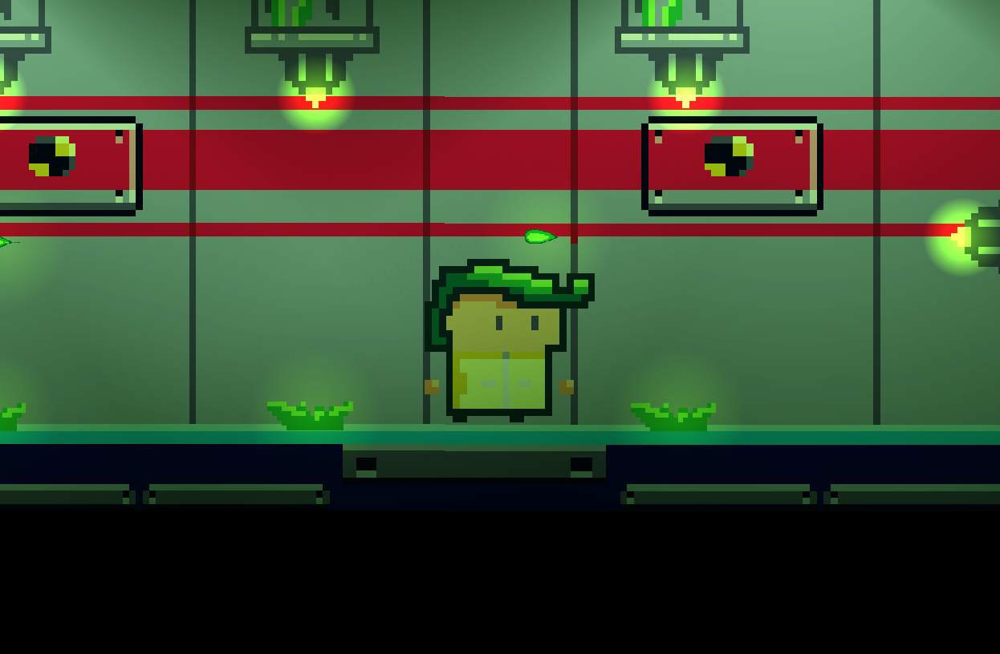

# Don't Die - Casual 2D game made in Unity

<!---Esses são exemplos. Veja https://shields.io para outras pessoas ou para personalizar este conjunto de escudos. Você pode querer incluir dependências, status do projeto e informações de licença aqui--->

> Don't die is a game i made in 1 week back in 2019, you need to succed in different room that have different kinds of challenges.
> 

## 💻 Requirements

Before starting, make sure you've met the following requirements:
* Unity 2019
* This game uses URP for 2D, it's not compatible with HTML5

## 📫 Contributing to Don't Die

To contribute to Don't die, follow these steps:

1. Fork this repository.
2. Create a branch: `git checkout -b <branch_name>`.
3. Make your changes and commit them: `git commit -m '<message_commit>'`
4. Push to the original branch: `git push origin <project_name> / <local>`
5. Create the pull request.

## 😄 Be one of the contributors 

Want to be part of this project? Click [HERE](CONTRIBUTING.md) and read how to contribute.

## 📝 License

This project is under license. See the [LICENSE](CC-BY-4.0.md) file for more details.

